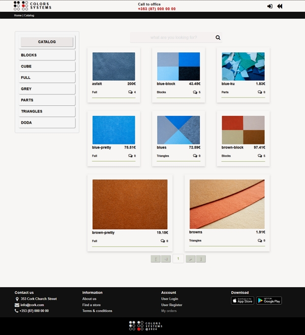
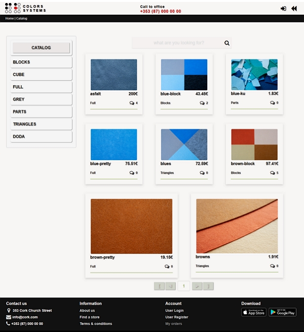

# React Module 1

## Project: e-shop

### User Login Credentials 🔐

| Role      | Username | Password |
|-----------|----------|----------|
| **Admin** | a@a.a    | password |
| **User1** | b@b.com  | password |
| **User2** | c@c.com  | password |

### Project details: 🏠

Table BD:

1. users: id / login / password / role(id)
2. roles: id / name
3. product: id / category(id) / name / price/ quantity/ units / description / imageUrl / comments[(id)]
4. cart: id / user(id) / products[(id)]/ totalPrice / productsPrice / shipmentPrice
5. order: id / user(id) / cart(id) / address[(id)]
6. address: id / user(id) / name/ lastName / phone / country / address /
7. category: id / name / imageUrl
8. comments: id / product(id) / author(id) content

Schema for redux store:

1. app: isLogout / isLogin / isOrders /isRegistered / isCart / modal :{ isOpen, text, onConfirm(), onCancel}
2. user: id / login / roleId / cartId / session
3. products[{ id / category:{ id, name } / imageUrl / price / quantity / description / unit / comments([id])}]:
    - page: a current number of page
    - totalPages
    - totalProducts
4. product(edit/show/addCart):  id / category:{ id, name } / imageUrl / price / quantity / description / unit /
   comments([id])
5. orders[{ orderId, userLogin, totalPrice, shipmentPrice, createdAt}]
6. categories[{id, name, imageUrl}]

#### [home]

#### [catalog]

#### [product]

#### [registration]

#### [login]

#### [header-user]

#### [cart]

#### [order]

#### [orders]

#### [header-admin]

#### [admin-remove-comment]

#### [admin-users]

#### [admin-manager-products]

#### [admin-search]

#### [admin-add-category]

#### [tooltip]

#### [alert-error]

